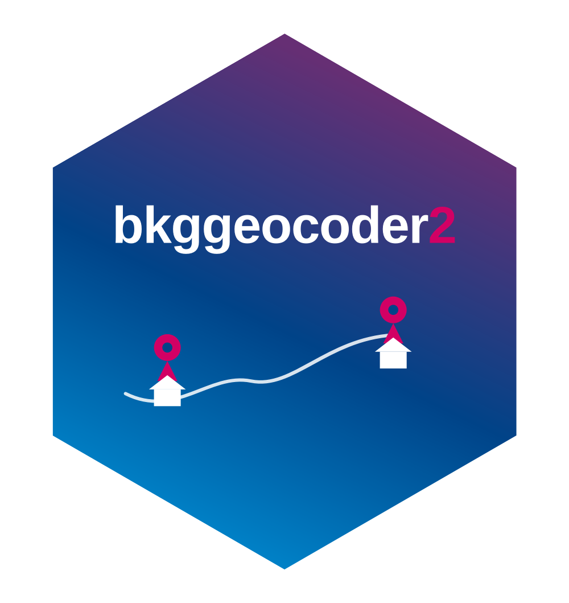

# bkggeocoder2



<!-- badges: start -->

[](https://www.repostatus.org/#active)
[](https://www.tidyverse.org/lifecycle/#experimental)

[](https://github.com/StefanJuenger/bkggeocoder2/actions/workflows/R-CMD-check.yaml)
[](https://app.codecov.io/gh/denabel/gxc)
[](https://choosealicense.com/licenses/mit/)

<!-- 
[](https://github.com/denabel/gxc/actions?query=workflow%3Apkgcheck)
[](https://app.codecov.io/gh/StefanJuenger/bkggeocoder2)
<!-- badges: end -->

> **Experimental rewrite.** `bkggeocoder2` is a ground-up rewrite of
> [`bkggeocoder`](https://github.com/StefanJuenger/bkggeocoder), focused
> exclusively on **offline** geocoding against a local address database.
> It is **not** a drop-in replacement: the online geocoding functions
> (`bkg_geocode`, `bkg_reverse`), the server-based data access, and the
> encrypted-data workflow from `bkggeocoder` have all been removed. If
> you relied on those features, stay on `bkggeocoder`. This package is
> under active development and its API, database schema, and matching
> logic may all still change without notice.

`bkggeocoder2` provides offline geocoding of German addresses using a
local address/coordinate database built from raw address data provided
by the [Federal Agency of Cartography and Geodesy
(BKG)](https://gdz.bkg.bund.de/index.php/default/webanwendungen/bkg-geocoder.html).
Its main functions are:

- `bkg_update_database()`: Build or refresh the local address database
  from raw BKG address data (works both for the initial build and later
  refreshes)
- `bkg_geocode_offline()`: Offline geocoding of structured address data
  (street, house number, zip code, place) against the local database

**WARNING**: This package is in active development. The matching logic,
the local database schema, and the public API may all still change.

## Requirements

Note that the use of BKG address data is restricted. You need access to
the raw BKG address data (`ga_<state>.csv` files, one per federal state)
to build the local database used by `bkg_geocode_offline()`. Unlike
`bkggeocoder`, this package does not require any server connection,
credentials, or data decryption – once built, the database lives
entirely on your local machine.

When using and publishing the results of the geocoding functions in this
package, always refer to the data source as follows:

© GeoBasis-DE / BKG, Deutsche Post Direkt GmbH, Statistisches Bundesamt,
Wiesbaden (2025)

## Installation

The package is available on GitHub. You can install the latest (stable)
version using the following code:

``` r
if (!require(pak)) install.packages("pak")
pak::pkg_install("StefanJuenger/bkggeocoder2")
```

The development version can be installed using:

``` r
if (!require(pak)) install.packages("pak")
pak::pkg_install("StefanJuenger/bkggeocoder2@dev")
```

## Usage

``` r
library(bkggeocoder2)

# Build the local database once (or refresh it later with the same call)
bkg_update_database(address_data_path = "path/to/raw/bkg/csvs")

# Geocode structured address data
addresses <- 
  data.frame(
    street = "Unter Sachsenhausen",
    house_number = "6-8",
    zip_code = "50667",
    place = "Köln"
  )

bkg_geocode_offline(addresses, cols = c(1:4))
```
